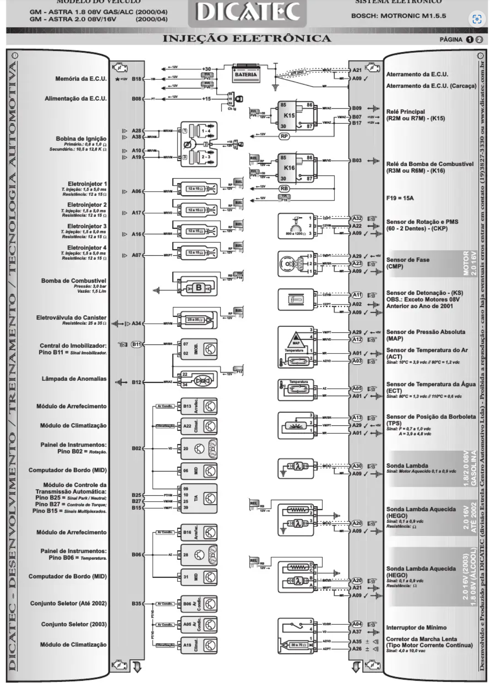
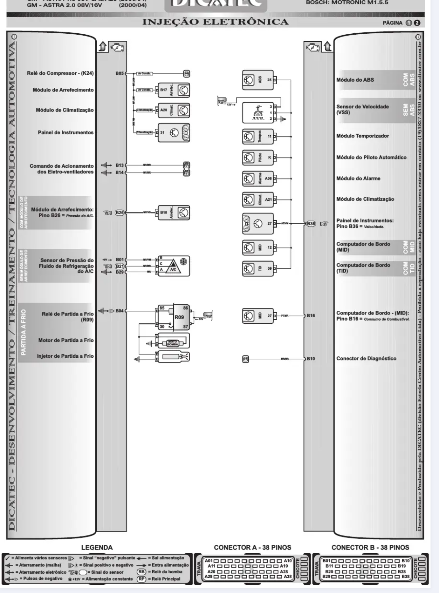

# Proteus Astra G 2.0 (Bosch M1.5.5 PnP)

# Acerto

## Alvo de Lenta

## Alvos de Lambda

## Alvos de Temperatura

## Pops

## Launch Control

## Demais funções a implementar

## Sujestões de moficações mecânicas

- Injetor de partida a frio

# Observações

## Atuador de Lenta

Atuador de lenta original funciona como um motor de passo DC, operado por ponte H. Testada a implementação do mesmo, porém o veículo mantém a mesma característica da I.E. original, com o controle de lenta sendo bastante deficiente e a rotação de marcha lenta oscilando. Além disso, foi notado que o atuador perde calibração após certo tempo de uso, sendo instável a razão de queda para lenta.

Foi optado por adaptar um atuador de lenta do tipo dupla solenóide, com código **0280140553**, utilizando um suporte impresso em 3D (Arquivo .STL salvo no repositório, impresso em ABS). Na parte elétrica, foi mantido o conector do atuador de lenta original, porém adicionado um conector extra para o novo.

**Limitações da implementação:** Por utilizar a entrada do coletor original da PCV, a mesma necessitou ser isolada, sendo necessário futuramente a adaptação de uma catch CAN.

## Temperatura e Ventoinhas

No veículo em si, há uma discrepância entre as documentações e os pinos da central original. Por se tratar de uma unidade com o módulo de arrefecimento, o acionamento das ventoinhas é realizado pelo módulo original, e não pela injeção original.
Para controlar a temperatura de funcionamento, é necessário modular um PWM de 100Hz no pino B06, sendo que 90% de duty equivale a 120 graus, e, 10% de duty a 60-. 

**Diante disso, pela temperatura no painel ser linkada com o acionamento da ventoinha, a mesma pode marcar diferente de antes, mesmo a temperatura real estando mais baixa.** Isto ocorre com a finalidade de acionar a ventoinha precocemente, e, pode ser ajustado caso a ventoinha esteja disparada antes da abertura da válvula termostática.

# Pinout

## Pinout I.E.  Original

## Pinout Proteus

**Black 23**
| Função | Pino Proteus | Pino Bosch |
| - | - | -| 
|Fase |1 | - | 
| Velocidade|2 |B36 | 
| DIG3 |3 |- | 
| Rotação 2+|4 |- | 
Rotação 1+|5 |A32 | 
|ETB1-|6 |- | 
|ETB1+|7 |- |
|ETB2-|8 |- |
|DIG5|9 |- |
|DIG1|10 | -|
|DIG6|11 |A04 |
|VR2-|12 |- |
|Rotação 1-|13 |A22 | 
|GND|14 |A09 | 
|ETB2+|15 |- | 
|CAN L|16 | Wide Can L |  
|CAN H|17 | Wide Can H |  
|12V Permanente|18 |B18 |  
|GND|19 | A21|  
|GND|20 | A09|  
|CAN2 L|21 |- |  
|CAN2 H|22 | -|  
|Retorno relé principal|23 | B07 e B17 e A04 |  

**White35**
| Função | Pino Proteus | Pino Bosch | 
| -|- |- |
|Sensor GND | 1 | - |  
|Sensor GND | 2 | A01 |  
|Sensor GND | 3 | B29 |  
|Sensor GND | 4 | B01 |  
|Sensor GND | 5 | - | 
|Sensor GND | 6 | - | 
|Sensor GND | 7 | - | 
|Sensor GND | 8 | - | 
|Sensor 5V | 9 | A29 | 
|Sensor 5V | 10 | -| 
|12V Sensores |11 |- |
|12V Sensores |12 |- |
|MAP |13 |A12 |
|TPS2 |14 |- |
|12V +15 |15 | B08| 
|PPS2 |16 | -|
|Sinal Ventoinha |17 | B13|
|Sinal Ar |18 |B35 |
|Temp 1 |19 | -|
|ECT |20 |A05 |
|Sensor 5V |21 | -|
|Sensor 5V | 22| -|
|Sensor GND | 23| -|
|TPS |24 |A13 |
|Sinal Ar 1 |25 | B26| 
|Sinal Ar 2 |26 | B21|
|Analog Volt 8 |27 | -|
|Analog Volt 10 |28 |- |
|Sensor GND |29 |- |
|IAT |30 | A03|
|Temp 4 |31 |- | 
|5V Sensor |32 | -| 
|5V Sensor |33 |- | 
|Knock 1 |34 | -| 
|Knock 2 |35 |- | 

BLACK35
| Função | Pino Proteus | Pino Bosch | 
| -|- |- |
| High 2| 1| -|
| High 1| 2| -|
| Inj 1|3 | A06|
| Inj 3|4| A16 |
| Luz injeção | 5 | B12 |
| Rotação Painel | 6 | B02 |
| Relé compressor | 7 | B05 | 
| Low 11 | 8 | B14 |
| Low 9 | 9 | - |
| At. Lenta 1|10 | A35 |
| At. Lenta 2|11 | A26 |
| Temperatura Painel |12 | B06|
|High 3 |13 |- |
|High 4 |14 |- |
|Inj 2 |15 | A17| 
|Inj 4 |16 | A07|
|PGND |17 |- |
|PGND |18 |- |
|Inj 8 |19 |- |
|Rele Bomba |20 |B03 |
|Rele Principal|21 |B09 |
| Ign 3 |22 | Mod Ign 3 / A10, A19 |
| Low 16 |23 |- |
| PGND |24 | -|
| Ign 12 |25 | -|
| Ign 11 |26 | -|
| Ign 10 |27 | -|
| Ign 9 |28 | -|
| Ign 8 |29 | -|
| Ign 7 |30 | -|
| Ign 6 | 31|- |
| Ign 5 | 32| -|
| Ign 4 | 33| -|
| Ign 2 | 34| -|
| Ign 1 | 35| Mod Ign 1 / A28, A38 |

## Conectores Extras

Foram adicionados três conectores extras ao veículo, dois deles na região da I.E., e, outro na região do atuador de lenta.

- Conector 3 vias região I.E.: 
	- Pino 1: 5V
	- Pino 2: USB D+
	- Pino 3: USB D-
		Observação: Este conector possui um terra em seu chicote, sendo o terra do USB, realizado no local original do aterramento da central eletrônica.

- Conector 2 vias região I.E.:
	- Pino 1: CAN H
	- Pino 2: CAN L
	Observação: Rede CAN construída com o par I.E. + leitor de wideband no painel, formando um rede com impedância de 60ohms.

- Conector 3 vias região do atuador de lenta:
	- Pino 1: Sinal atuador de lenta (1000Hz Low)
	- Pino 2: 12V +15
	- Pino 3: Sinal atuador de lenta (1000Hz Low)
